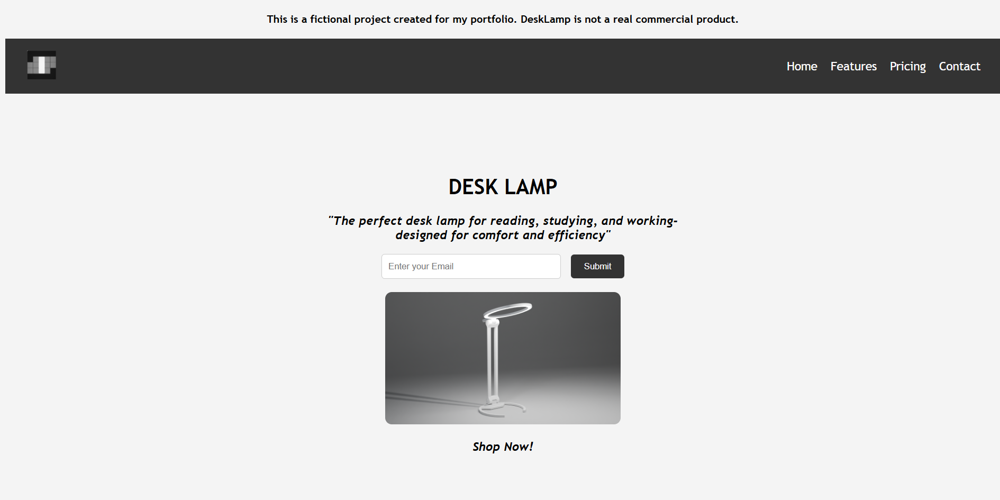
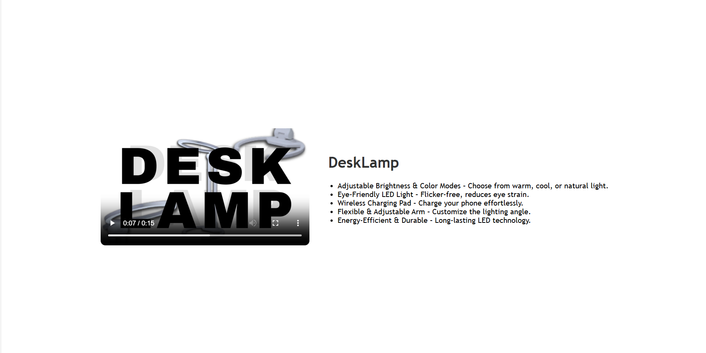

# 💡 DeskLamp - Product Landing Page

A responsive product landing page for a fictional desk lamp brand. This project showcases a clean and modern user interface featuring a navigation bar, product hero section, email subscription form, and a call-to-action button.

> This is a fictional project created for learning and portfolio purposes.

## 🌐 Live Demo

🔗 [https://your-demo-link-here](https://bhaveshbhoi256.github.io/DeskLamp_Product_Landing_Page/)

## 📸 Preview




## ✨ Features

- Responsive landing page design
- Modern and minimal UI
- Product showcase section
- Email subscription form
- Navigation bar with menu links
- Call-to-action button
- Clean layout using Flexbox

## 🛠️ Technologies Used

- HTML5
- CSS3

## 📂 Project Structure

```text
DeskLamp/
├── index.html
├── style.css
├── preview.png
└── README.md
```

## 🎯 Learning Outcomes

- Semantic HTML structure
- CSS styling and positioning
- Flexbox layouts
- Responsive web design
- Product landing page development

## 🚀 Getting Started

1. Clone the repository

```bash
git clone https://github.com/your-username/desklamp.git
```

2. Open the project folder

```bash
cd desklamp
```

3. Open `index.html` in your browser.

## 👨‍💻 Author

**Bhavesh**

Frontend Development Assignment – Product Landing Page

---

⭐ If you found this project interesting, consider giving it a star!
